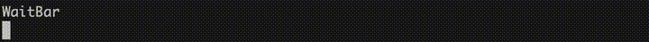
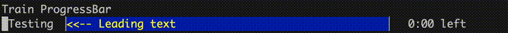

# goprogress

Create a progress bar of various types \






## Usage

To start using argparse in Go see above instructions on how to install. From here on you can start writing your first
program. Please check out examples from examples/ directory to see how to use it in various ways.

Here is basic example of print command (from examples/print/ directory):

## Options

```go
type Options struct {
Total              int
Width              int
Title              string
Footer             string
BarText            string
FillText           string
Animated           bool
BarColour          []float32
FillColour         []float32
LightTextColour    []float32
DarkTextColour     []float32
BarTextColour      []float32
FillTextColour     []float32
DynamicTextColours bool
Partials           []string
Terminators        []string
Mode               int8
}
```

| Option                 | Description                                                                                       |
|------------------------|:--------------------------------------------------------------------------------------------------|
| **Total**              | Amount that constitutes a full bar                                                                |
| **Width**              | The width of the bar to the maxium of the screen                                                  |
| **Title**              | The title at the beginning of the  bar                                                            |
| **BarText**            | Text that will appear in the bar or repeated in the bar                                           |
| **FillText**           | Text that will appear in the fill or repeated in the bar                                          |
| **FillText**           | Text that will appear in the fill or repeated in the bar                                          |
| **Animated**           | Future revision                                                                                   | |
| **BarColour**          | The colour of the bar                                                                             |
| **FillColour**         | The colour of the remainder                                                                       |
| **LightTextColour**    | The colour of the text that appears of a dark fill                                                |
| **DarkTextColour**     | The colour of the text that appears of a light fill                                               |
| **BarTextColour**      | The colour of the text that appears in the bar                                                    |
| **FillTextColour**     | The colour of the text that appears in the fill                                                   |
| **DynamicTextColours** | Choose th colour for the bar/fill                                                                 |
| **Partials**           | The individual character that make up the fractional spaces                                       |
| **Terminators**        | The chracter at the front and end of the bar                                                      |
| **Mode**               | 0 = None, 1 = Show percentage, <br/>2 = Show time prediction, <br/>3 = Show   proportion Ex. 1/10 |

### Constants

package goprogress

#### Modes

const ModeNone = 0 \
const ModePercent = 1 \
const ModeTimer = 2 \
const ModeProportion = 3

#### Styles

const StyleSimple = 1 \
const StyleTrain = 2 \
const StyleDetailed = 3 \
const StyleSmooth = 4 \
const StyleWait = 0

#### Colours

Black() \
\
LtGrey() \
Grey() \
DkGrey() \
\
LtRed() \
Red() \
DkRed() \
\
LtGreen() \
Green() \
DkGreen() \
\
LtBlue() \
Blue() \
DkBlue() \
\
LtCyan() \
Cyan() \
DkCyan() \
\
LtMagenta() \
Magenta() \
DkMagenta() \
\
LtYellow() \
Yellow() \
DkYellow() \
\
White() \
\
NoColour()

### Disection

```ignorelang
| Title  | Bar Text  | Bar Fill                            | Mode   | Footer  |
 Testing |===========--------------------------------------| 120/120 files
         | Width                                           |
         | Bar       | Fill                                |
```

## Bar types

### Wait (gororess.DrawWaitBar)


Draws a repeating pattern that moves left to right on each call \

Options with no effect

- Footer
- FillText
- FillColour
- Partials

### Simple (gororess.DrawSimpleProgressBar)


A repeating character that makes up a bar with a divider and a repeating character that makes up the fill

Options with no effect

- Animated
- Partials

### Train (gororess.DrawTrainProgressBar)


A string that moves left to right replacing a repeating character that makes up the fill

Options with no effect

- Animated
- Partials

### Detailed (gororess.DrawDetailedProgressBar)


A bar that contains text and a progress represented by colour

Options with no effect

- Animated
- Partials

### Smooth (gororess.DrawSmoothProgressBar)


 \
A bar that uses fractional characters to represent a smoother movement

Options with no effect

- BarText
- FillText
- Animated
- LightTextColour
- DarkTextColour
- BarTextColour
- FillTextColour
- DynamicTextColours

## Methods
All Set method return the parent and can be chained
Example 
```go 
bar.SetStyle(goprogress.StyleSimple).
	SetMode(goprogress.ModePercent)
````

### NewProgressBar Create a new instance of a progress bar

- NewProgressBar(style int8, options Options) *bar

### Draw the progress with text (and colour)

- Draw(progress int, options ...Options)

### ResetTimer Reset the timer if a bar does not complete

- ResetTimer()

### SetStyleSimple Set style to simple

- SetStyleSimple()
- GetStyleSimple() bool

### SetStyleTrain Set style to train

- SetStyleTrain()
- GetStyleTrain() bool

### SetStyleDetailed Set style to detailed

- SetStyleDetailed()
- GetStyleDetailed() bool

### SetStyleSmooth Set style to smooth

- SetStyleSmooth()
- GetStyleSmooth() bool

### SetStyle Set to display style

- SetStyle(mode int8)
- GetStyle() int8

### SetOptions Set total (max value of the progress bar)

- SetOptions(options Options)
- GetOptions() Options

### SetTotal Set total (max value of the progress bar)

- SetTotal(total int)
- GetTotal() int

### SetWidth Set the width of the progress bar

- SetWidth(width int)
- GetWidth() int

### SetTitle Set title at the beginning of the bar

- SetTitle(title string)
- GetTitle() string

### SetFooter Set text at the end

- SetFooter(footer string)
- GetFooter() string

### SetBarText Set text at the end

- SetBarText(text string)
- GetBarText() string

### SetFillText Set text at the end

- SetFillText(text string)
- GetFillText() string

### SetText Set all text

- SetText(title string, footer string, barText string, fillText string)
- GetText() (string, string, string, string)

### SetBarColour Set bar colour

- SetBarColour(colour []float32)
- GetBarColour() []float32

### SetFillColour Set the fill colour (opposite of the bar)

- SetFillColour(colour []float32)
- GetFillColour() []float32

### SetColours Set bar and fill colour

- SetColours(barColour []float32, fillColour []float32)
- GetColours() ([]float32, []float32)

### SetLightTextColour Set text colour that appears over dark colours

- SetLightTextColour(colour []float32)
- GetLightTextColour() []float32

### SetDarkTextColour Set text colour that appears over light colours

- SetDarkTextColour(colour []float32)
- GetDarkTextColour() []float32

### SetBarTextColour Set text colour that appears over dark colours

- SetBarTextColour(colour []float32)
- GetBarTextColour() []float32

### SetFillTextColour Set text colour that appears over light colours

- SetFillTextColour(colour []float32)
- GetFillTextColour() []float32

### SetTextColours Set all text colours

- SetTextColours(lightTextColour []float32, darkTextColour []float32, arTextColour []float32, fillTextColour []float32)
- GetTextColours() ([]float32, []float32, []float32, []float32)

### SetDynamicTextColours Forgo the light and dark colour and use the fill/bar colours

- SetDynamicTextColours(dynamic bool)
- GetDynamicTextColours() bool

### SetPartials Set partials for the smooth bar

- SetPartials(partials []string)
- GetPartials() []string

### SetTerminators Set the start and end character for the bar

- SetTerminators(start string, end string)
- GetTerminators() []string

### SetModeNone Set to hide progress/timer/proportion

- SetModeNone()
- GetModeNone() bool

### SetModePercent Set to display progress

- SetModePercent()
- GetModePercent() bool

### SetModeTimer Set to display to timer

- SetModeTimer()
- GetModeTimer() bool

### SetModePortions Set to display portions

- SetModePortions()
- GetModePortions() bool

### SetMode Set to display the mode

- SetMode(mode int8)
- GetMode() int8

### Sample

```go
package main

import (
	"fmt"
	"github.com/thedzy/goprogress"
	"time"
)

func main() {
	// Example from the readme
	total := 25
	progress := 0

	options := goprogress.Options{
		Total:          total,
		Width:          50,
		BarText:        "◢◤  ◢◤  ",
		BarColour:      []float32{1.0, 1.0, 0.0},
		FillColour:     []float32{0.0, 0.0, 0.5},
		BarTextColour:  []float32{0.9, 0.0, 0.0},
		FillTextColour: []float32{0.0, 0.0, 0.9},
		Title:          "Loading",
		Terminators:    []string{"[", "]"},
	}

	waitBar := goprogress.NewProgressBar(goprogress.StyleWait, options)

	fmt.Println("Wait Bar")
	for progress < total {
		progress++
		time.Sleep(100 * time.Millisecond)

		// Update the wait bar
		waitBar.Draw(progress)
	}
	fmt.Println("\n")

	simpleBar := goprogress.NewProgressBar(goprogress.StyleSimple, options)
	simpleBar.SetBarText("◤◢◣◥")
	simpleBar.SetBarColour(goprogress.Red())
	simpleBar.SetBarTextColour([]float32{0.25, 0.0, 0.0})
	simpleBar.SetFillColour([]float32{0.25, 0.0, 0.0})
	progress = 0

	fmt.Println("Detailed Bar")
	for progress < total {
		progress++
		time.Sleep(100 * time.Millisecond)

		// Update the wait bar
		simpleBar.Draw(progress)
	}
	fmt.Println("\n")
}

```

## Why?

I like progress bars and and easy way to implement them

## Improvements?

Add animation to moving bars

## State?

~~Empty string in wait bar causes div by zero, will fix very soon~~

### Troubleshooting

I learning why I have never seen a v2 of a go module... \
If it's trying to download a version that does not exist: \
`GOPROXY=direct go get github.com/thedzy/goprogress/v2@v2.0.0`

## New

### 2.0

- Complete rewrite,
- Divided up into files that define their purpose
- Made more options universal
- Made all colours options
- Renamed methods and variables to be more clear as to what purpose they serve
- Made one universal draw function which allows for dynamic switching between types
- More of a proper class structure and can be instantiated
- Using constants for things like Mode (and now style) to be set
- Working windows sizing

### 2.1.1

- Updated to take options at the Draw command. Due to limitations with GO, you cannot override any parameter with 0, or
  false or "". ~~One day I will make this pointers, but there is a lot of change to accommodate~~
- Slight reorganisation in code
- Fixed an error when passing an empty string to the wait bar.

### 2.1.2
_ Add more ways to set options